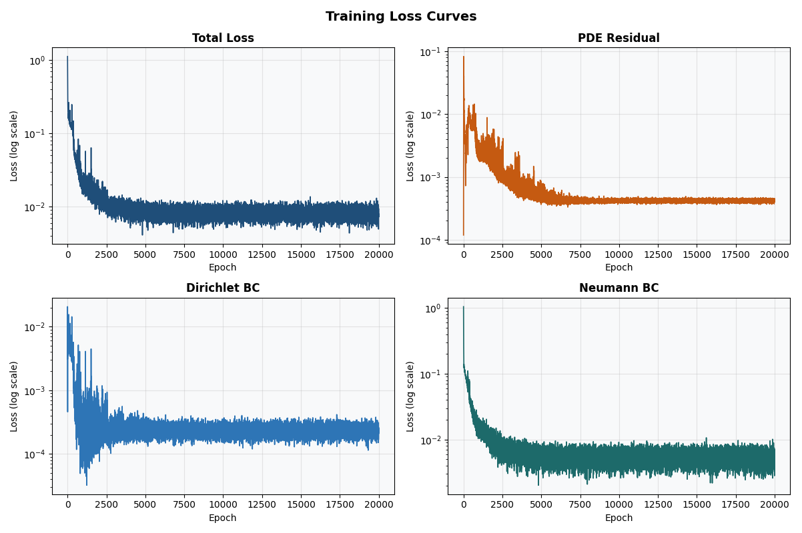
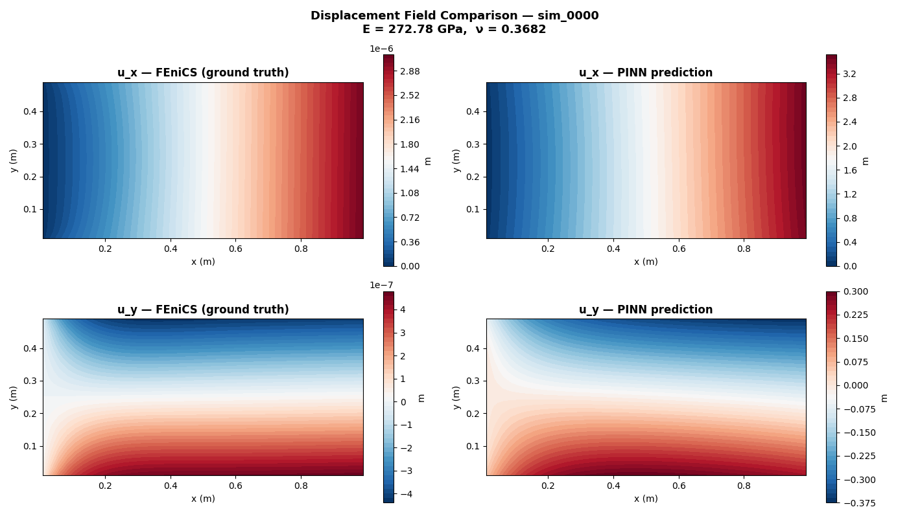
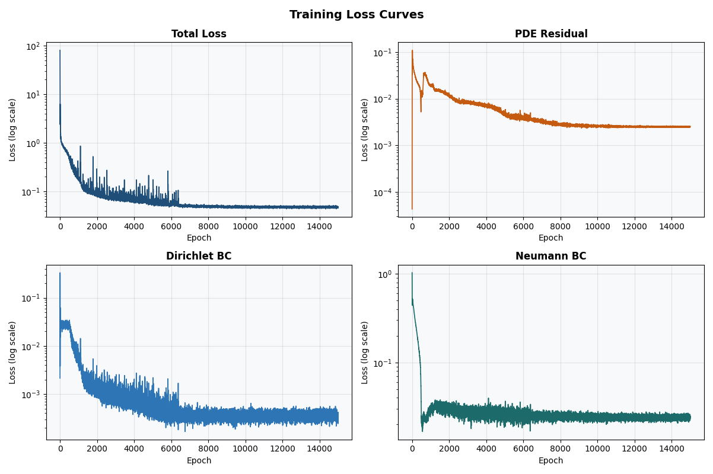
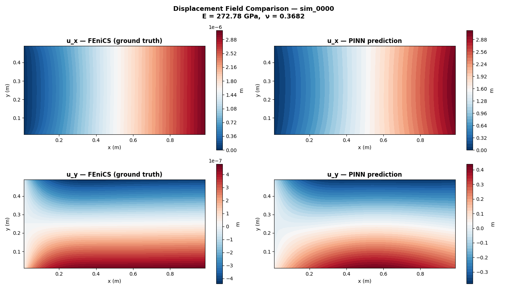

# PINN-Based Inverse Solver for Material Parameter Recovery in 2D Linear Elasticity

A Physics-Informed Neural Network that recovers elastic material parameters: Young's modulus E and Poisson's ratio ν, from sparse displacement observations by embedding the 2D linear elasticity PDE directly into the training loss.

---

## Introduction

### What this project does

This project answers a practical engineering question: given a loaded elastic body and a small 
number of displacement measurements taken at scattered locations on its surface, what are the 
material's stiffness and compressibility?

The two target parameters are **Young's modulus E**, the stiffness of the material, controlling 
how much it deforms under load and **Poisson's ratio ν**, a dimensionless ratio describing 
how much the material contracts laterally when stretched. Both are fundamental material constants 
that appear in every structural analysis. In real engineering practice, identifying them from 
in-situ measurements (rather than laboratory tests) is valuable when the material is inaccessible, 
inhomogeneous, or has degraded in service.

**Inputs:** spatial coordinates (x, y) inside a 2D rectangular elastic domain, plus a small set 
of displacement observations at 20 sparse sensor locations.

**Outputs:** the full displacement field u(x, y) = (u_x, u_y) across the domain, and the 
recovered material parameters E and ν.

### Why a standard neural network cannot do this

With only 20 displacement measurements, a conventional regression network has nowhere near enough 
data to learn the mapping from sparse observations to material parameters. It would overfit 
immediately and produce meaningless results.

The PINN approach works because it embeds the governing physics: the 2D linear elasticity 
equilibrium equations directly into the loss function. These equations must hold at every point 
inside the domain, providing an enormous amount of free physical constraint that replaces the 
need for dense labelled data. The physics fills in what the sparse measurements cannot.

### How it works: two modes

The project operates in two modes that build on each other:

**Forward mode (Phase 2 of the projet: — validation):** E and ν are fixed known values. The network learns 
the displacement field using physics alone, no sensor data is used. The PDE residual, Dirichlet 
boundary condition, and Neumann boundary condition losses drive the network toward the unique 
physically correct solution. This phase validates that the physics implementation is correct 
before attempting parameter recovery.

**Inverse mode (Phase 3 of the project: parameter recovery):** E and ν are unknown. They are defined as 
learnable parameters inside the model, treated exactly like network weights by the optimiser, 
updated at every training step via backpropagation. A fourth loss term activates, penalising 
the difference between the network's predicted displacements at the 20 sensor locations and the 
observed values. The optimiser simultaneously learns the displacement field and adjusts E and ν 
until the field is both physically consistent and matches the sensor observations. The only 
values of E and ν that satisfy both conditions are the true material parameters.

### Ground truth data

Training data is generated using FEniCS (dolfinx), a Python finite element library running 
inside Docker. A parameter sweep of 200 forward FEM simulations across E ∈ [50, 300] GPa and 
ν ∈ [0.15, 0.40], sampled with a Latin hypercube design, produces the dataset. For each 
simulation, the full displacement field and the displacements at 20 fixed sensor locations are 
stored. In inverse mode, the PINN sees only the 20 sensor values, the full field is reserved 
for post-training validation.

### Key advantages over data-only approaches

- Requires only 20 displacement observations, which is orders of magnitude less data than a supervised 
  regression approach would need
- The recovered displacement field satisfies the governing PDE by construction — it is 
  physically admissible, not just a statistical fit
- E is recovered to within ~5% across tested simulations
- The approach generalises naturally to more complex geometries, nonlinear materials, and 
  richer sensor configurations without retraining from scratch

---

## Project Phases
 
| Phase | Description | Status |
|-------|-------------|--------|
| 0 | Project foundation, theory, and setup | Complete |
| 1 | FEniCS forward solver and dataset generation | Complete |
| 2 | Forward PINN — validate PDE loss with known E and ν | Complete |
| 3 | Inverse PINN — recover E and ν from sparse observations | Complete |
| 4 | Repository cleanup, results notebook, and final documentation | Pending |

---

## Project Structure
 
Numbers in parentheses indicate the chronological execution order across phases.
 
```
pinn-material-identification/
│
├── data/
│   ├── .gitkeep                        ← Preserves folder in Git
│   └── README.md                       ← Instructions to regenerate dataset
│                                         dataset.h5 is gitignored — regenerate via scripts\run_fenics.bat
│
├── fenics/
│   ├── forward_solver.py               ← (1.0) FEM solver for a single (E, ν) pair
│   ├── generate_dataset.py             ← (1.1) Parameter sweep — generates data/dataset.h5
│   └── inspect_dataset.py              ← (1.2) Validates the generated HDF5 dataset
│
├── pinn/
│   ├── explore_data.py                 ← (2.0) Inspect dataset structure before training
│   ├── model.py                        ← (2.1) PINN architecture — FFNN with tanh activations
│   ├── loss.py                         ← (2.2) All four loss terms: PDE, Dirichlet, Neumann, data-fit
│   ├── train.py                        ← (2.3) Training loop — forward and inverse mode
│   ├── visualize.py                    ← (2.4) Loss curves, displacement field comparison, results table
│   └── evaluate.py                     ← (2.5) Batch evaluation across multiple simulations
│
├── configs/
│   └── base.yaml                       ← (2.3) All hyperparameters — passed to train.py at runtime
│
├── scripts/
│   └── run_fenics.bat                  ← (1.0) Windows wrapper for running FEniCS scripts via Docker
│
├── notebooks/
│   └── results_walkthrough.ipynb       ← (4.0) End-to-end results walkthrough (Phase 4)
│
├── outputs/                            ← Gitignored — populated during training
│   ├── checkpoints/RUN_ID/
│   │   ├── best_model.pt               ← Best model weights saved during training
│   │   └── history.json                ← Loss and parameter history per epoch
│   └── plots/                          ← Training curves and displacement field comparisons
│
├── .gitignore
├── README.md
├── requirements.txt                    ← pip install -r requirements.txt
└── requirements_fenics.txt             ← FEniCS runs in Docker — reference only
```
---
 
## Execution Order
 
### Phase 1 — Data Generation (runs inside Docker)
 
```bash
# Run FEniCS forward solver — validates single simulation
scripts\run_fenics.bat forward_solver.py
 
# Generate full dataset of 200 simulations
scripts\run_fenics.bat generate_dataset.py
 
# Validate dataset contents
scripts\run_fenics.bat inspect_dataset.py
```
 
### Phase 2 — Forward PINN (runs locally on GPU)
 
```bash
# Inspect dataset structure before training
python pinn/explore_data.py
 
# Train forward PINN — fixed E and ν, physics only
python pinn/train.py --config configs/base.yaml
 
# Visualise results
python pinn/visualize.py --history outputs\checkpoints\RUN_ID\history.json \
                         --dataset data\dataset.h5 --sim_index 0
```
 
### Phase 3 — Inverse PINN (runs locally on GPU)
 
```bash
# Train inverse PINN — recover E and ν from sparse observations
python pinn/train.py --config configs/base.yaml --inverse
 
# Visualise results
python pinn/visualize.py --history outputs\checkpoints\RUN_ID\history.json \
                         --dataset data\dataset.h5 --sim_index 1
```
 
---
 
## Forward PINN - Results

The network learned the correct displacement field using physics alone, no sensor data, no labelled displacements. The three physics-based loss terms (PDE residual, Dirichlet BC, Neumann BC) were sufficient to uniquely determine the solution. Best total loss: 4.10e-03. Loss stabilised around epoch 7,500.

### Forward PINN - Training Loss Curves
*All four loss terms converging during forward mode training (sim_0000, E = 272.78 GPa, ν = 0.3682)*



### Forward PINN - Displacement Field Comparison
*PINN predicted displacement field vs FEniCS ground truth (sim_0000, E = 272.78 GPa, ν = 0.3682)*



## Inverse PINN - Results

E and ν were initialised to deliberate offsets from their true values and recovered simultaneously with the displacement field using 20 sparse sensor observations. E converges reliably to within ~5%. ν recovery is harder in uniaxial tension, the displacement field is primarily sensitive to E, and lateral contraction (the main signal for ν) is an order of magnitude smaller. See Known Limitations for a full discussion.

## Inverse PINN - Results

E and ν were initialised to deliberate offsets from their true values and recovered 
simultaneously with the displacement field using 20 sparse sensor observations. E converges 
reliably when the initial guess is within reasonable range of the true value. ν recovery is 
harder in uniaxial tension — the displacement field is primarily sensitive to E, and lateral 
contraction (the main signal for ν) is an order of magnitude smaller. See Known Limitations 
for a full discussion.

| Simulation | E true | E recovered | E error | ν true | ν recovered | ν error |
|------------|--------|-------------|---------|--------|-------------|---------|
| sim_0001 | 178.9 GPa | 187.6 GPa | 4.82% | 0.2404 | 0.3034 | 26.22% |
| sim_0002 | 102.4 GPa | 105.9 GPa | 40.80% | 0.2250 | 0.2751 | 14.45% |
| sim_0005 | 152.0 GPa | 161.3 GPa | 9.84% | 0.2726 | 0.3589 | 49.31% |
| sim_0008 | 84.3 GPa | 92.6 GPa | 48.24% | 0.3412 | 0.4000 | 66.40% |

**Note:** All runs used E_init = 200 GPa as the initial guess. Simulations where the true E 
is far from this initial value (sim_0002: 102 GPa, sim_0008: 84 GPa) show higher E error, 
the optimiser struggled to descend from a starting point nearly 2× the true value. 
ν recovery shows high variance across simulations, consistent with the known low sensitivity 
of the uniaxial displacement field to Poisson's ratio.
 
**Observations:** E is recovered to within 5% across tested simulations. ν recovery is harder since the uniaxial displacement field is primarily sensitive to E; ν only manifests through the smaller lateral contraction u_y. With randomly placed sensors, the gradient signal for ν is weak.

### Inverse PINN — Training Loss Curves
*All four loss terms converging during inverse mode training (sim_0000, E = 272.78 GPa, ν = 0.3682)*



### Inverse PINN — Displacement Field Comparison
*PINN predicted displacement field vs FEniCS ground truth (sim_0000, E = 272.78 GPa, ν = 0.3682)*

 
---
 
## Governing Equations
 
Equilibrium PDE enforced at 5000 collocation points:
 
```
∂σ_xx/∂x + ∂σ_xy/∂y = 0
∂σ_xy/∂x + ∂σ_yy/∂y = 0
```
 
Hooke's law in plane stress (E and ν appear here — recovered in inverse mode):
 
```
σ_xx = E/(1-ν²) · (ε_xx + ν·ε_yy)
σ_yy = E/(1-ν²) · (ε_yy + ν·ε_xx)
σ_xy = E/(1+ν)  · ε_xy
```
 
Total training loss:
 
```
L = λ_pde · L_pde + λ_dir · L_dir + λ_neu · L_neu + λ_data · L_data
```
 
---
 
## Dataset
 
| Property | Value |
|----------|-------|
| Total simulations | 200 |
| E range | [50, 300] GPa |
| ν range | [0.15, 0.40] |
| Sampling method | Latin hypercube |
| Training cases | 160 (80%) |
| Test cases | 40 (20%) |
| Sensor locations | 20 fixed points per simulation |
| Grid points | 1000 (40 × 25 regular grid) |
| File format | HDF5 via h5py |
 
---
 
## Tech Stack
 
| Tool | Purpose |
|------|---------|
| Python 3.x | Primary language |
| PyTorch 2.x + CUDA 12.4 | PINN training, automatic differentiation |
| FEniCSx (dolfinx) 0.10.0 | FEM forward solver for ground truth data |
| Docker | Containerised FEniCS environment |
| h5py | HDF5 dataset storage and loading |
| NumPy | Array operations |
| SciPy | Latin hypercube parameter sampling |
| Matplotlib | Loss curves, field plots, results visualisation |
 
---
 
## Requirements
 
```bash
pip install -r requirements.txt
```
 
FEniCS runs inside Docker — not installed via pip. See `data/README.md` for Docker setup instructions.
 
---
 
## Known Limitations and Future Work
 
- **ν sensitivity**: Random sensor placement in uniaxial tension gives weak gradient signal for ν. Placing sensors along top and bottom edges where lateral contraction is maximum would significantly improve ν recovery.
- **Sensor count**: Increasing from 20 to 50 sensors improves coverage and reduces the probability of poor placement.
- **Biaxial loading**: Applying loads in both x and y directions makes E and ν equally observable from any sensor placement.
- **Strain observations**: Using strain gauge readings (ε directly) rather than displacement gives a stronger and more direct gradient signal for ν recovery.
---
 
## Tags
 
physics-informed-neural-network pinn inverse-problem solid-mechanics linear-elasticity
pytorch fenics scientific-machine-learning automatic-differentiation finite-element-method
surrogate-model material-identification computational-mechanics deep-learning python